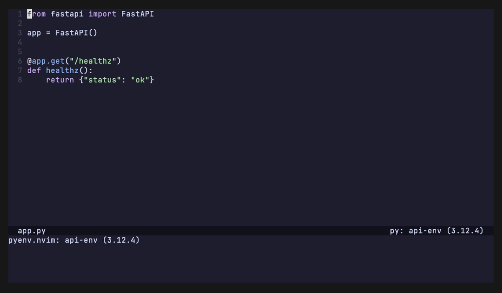
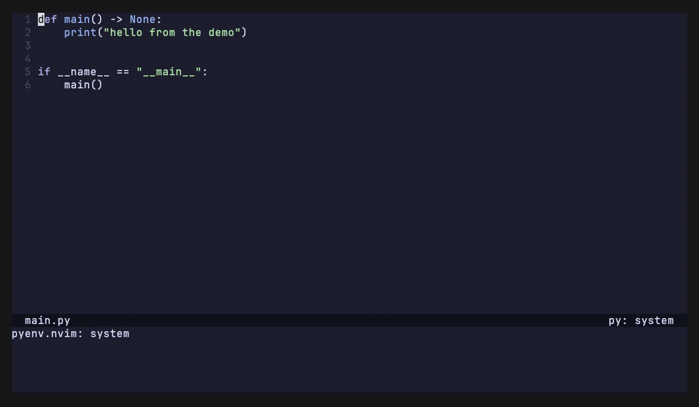

# pyenv.nvim

[](https://github.com/yal212/pyenv.nvim/actions/workflows/ci.yml)
[](https://neovim.io)
[](LICENSE)

pyenv integration for Neovim. Works out which Python is active for the directory
you're in, points your LSP, debugger and terminals at it, and lets you install
versions and create virtualenvs without leaving the editor.



*The same `:Pyenv` in two projects: the answer changes, and it names the file
that decided it.*

No plugin dependencies. The picker uses `vim.ui.select`, so it adopts whichever
picker you already have.

## Contents

- [Requirements](#requirements)
- [Installation](#installation)
- [Quick start](#quick-start)
- [Commands](#commands)
- [Configuration](#configuration)
- [How the environment is chosen](#how-the-environment-is-chosen)
- [Language servers](#language-servers)
- [Lua API](#lua-api)
- [Statusline](#statusline)
- [Health check](#health-check)
- [Troubleshooting](#troubleshooting)
- [How this compares](#how-this-compares)
- [Contributing](#contributing)
- [License](#license)

## Requirements

**Required**

- Neovim 0.11 or newer, for `vim.lsp.config` / `vim.lsp.enable`. The plugin
  refuses to load below that and says so.

**Optional**

- **pyenv** - only for *installing* and *removing*. Listing and switching read
  `$PYENV_ROOT` from disk and work even when `pyenv` isn't on Neovim's `PATH`,
  which is routine for GUI launches on macOS.
- **nvim-dap-python**, or nvim-dap on its own. Without one of them,
  `dap.enabled` has nothing to configure and quietly does nothing.
- **Any `vim.ui.select` provider** (telescope, fzf-lua, snacks, dressing) for a
  nicer `:Pyenv select`. The built-in prompt is used otherwise.
- **lualine**, for the component below.

## Installation

<details open>
<summary><b>lazy.nvim</b></summary>

```lua
{ "yal212/pyenv.nvim", opts = {} }
```

</details>

<details>
<summary><b>mini.deps</b></summary>

```lua
MiniDeps.add({ source = "yal212/pyenv.nvim" })
```

</details>

<details>
<summary><b>packer.nvim</b></summary>

```lua
use({ "yal212/pyenv.nvim" })
```

</details>

<details>
<summary><b>vim-plug</b></summary>

```vim
Plug 'yal212/pyenv.nvim'
```

</details>

`setup()` is optional - the plugin initialises itself with sensible defaults.
Call it only to change something.

## Quick start

```vim
:Pyenv                          " status: what's active, and why
:Pyenv select                   " pick an environment
:Pyenv install 3.13.2           " streamed into a floating window, cancellable
:Pyenv virtualenv 3.12.4 myapp  " create and activate
:checkhealth pyenv              " diagnose
```

No keys are bound. Two `<Plug>` mappings are provided:

```lua
vim.keymap.set("n", "<leader>pv", "<Plug>(pyenv-select)")
vim.keymap.set("n", "<leader>pr", "<Plug>(pyenv-reset)")
```

## Commands

Everything lives under one command, with completion for subcommands and their
arguments. Bare `:Pyenv` behaves as `:Pyenv status`.

| Command | Description |
|---|---|
| `:Pyenv status` | Show the active environment and why it was chosen |
| `:Pyenv select` | Pick an environment interactively |
| `:Pyenv activate {name}` | Pin an environment for this project |
| `:Pyenv reset` | Unpin this project and resolve afresh |
| `:Pyenv local [{name}]` | Write `.python-version` in the current directory |
| `:Pyenv global [{name}]` | Set the pyenv global version |
| `:Pyenv install [{version}]` | Install a Python version |
| `:Pyenv install --refresh` | Re-fetch the list of installable versions |
| `:Pyenv uninstall {name}` | Remove an installed version or virtualenv |
| `:Pyenv virtualenv {version} {name}` | Create a pyenv virtualenv and activate it |
| `:Pyenv rehash` | Regenerate pyenv shims |
| `:Pyenv health` | Run the pyenv.nvim health check |

A few details worth knowing:

- **`install`** streams output into a floating window that never takes focus, so
  you can keep working while it builds. `q` closes it, cancelling the build if it
  is still running. The installable-version list is fetched once per session;
  completion primes it in the background, so the *first* `<Tab>` offers nothing
  and a later one offers versions. `--refresh` re-fetches.
- **`uninstall`** always confirms, and the default answer is No.
- **`activate`** is remembered per project in `stdpath("data")` - nothing is
  written into your repository. Use `:Pyenv local` when you actually want a
  committed `.python-version`.



*A real build, time-compressed in the middle. The minutes it takes are the
reason the window doesn't take focus.*

## Configuration

```lua
require("pyenv").setup({
  root = nil,                 -- override $PYENV_ROOT
  auto_activate = true,       -- re-resolve on VimEnter and DirChanged
  resolution_order = { "override", "shell", "local", "project_venv", "global", "system" },
  lsp = {
    enabled = true,
    servers = { "pyright", "basedpyright", "pylsp" },
    strategy = "notify",      -- "notify" | "restart"
  },
  dap = { enabled = true },
  terminal = { set_path = true, set_virtual_env = true },
  python3_host_prog = false,  -- an env without pynvim breaks remote plugins
  notify = "changes",         -- "all" | "changes" | "errors" | false
  cache = { enabled = true },
})
```

| Option | Type | Default | Notes |
|---|---|---|---|
| `root` | `string?` | `nil` | Overrides `$PYENV_ROOT`, which falls back to `~/.pyenv` |
| `auto_activate` | `boolean` | `true` | Re-resolve on `VimEnter` and `DirChanged` |
| `resolution_order` | `string[]` | all six steps | Steps may be reordered or omitted |
| `lsp.enabled` | `boolean` | `true` | |
| `lsp.servers` | `string[]` | pyright, basedpyright, pylsp | |
| `lsp.strategy` | `"notify"` or `"restart"` | `"notify"` | How a *running* client is told |
| `dap.enabled` | `boolean` | `true` | No-op without nvim-dap(-python) |
| `terminal.set_path` | `boolean` | `true` | Prepend `<env>/bin` to `PATH` |
| `terminal.set_virtual_env` | `boolean` | `true` | Export `VIRTUAL_ENV` for virtualenvs |
| `python3_host_prog` | `boolean` | `false` | Point `g:python3_host_prog` at the env; reverted when it stops being usable |
| `notify` | `"all"`, `"changes"`, `"errors"`, `false` | `"changes"` | Checked by value; `true` means `"all"` |
| `cache.enabled` | `boolean` | `true` | Remember the pin per project |
| `cache.path` | `string?` | `nil` | Defaults to `stdpath("data")/pyenv.nvim/projects.json` |

Unknown options, wrong types and unrecognised values for `notify` and
`lsp.strategy` are rejected with an explicit error rather than silently
ignored. List-like tables are replaced wholesale rather than merged
index by index, so `lsp.servers = { "pyright" }` really does mean only pyright.

The per-project pin is keyed by project root - the nearest ancestor containing
any of `.python-version`, `pyproject.toml`, `setup.py`, `setup.cfg`,
`requirements.txt`, `.venv` or `.git`.

## How the environment is chosen

First match wins:

1. `override` - pinned with `:Pyenv activate`
2. `shell` - `$PYENV_VERSION`
3. `local` - nearest `.python-version`, searching upward
4. `project_venv` - `.venv/`, `venv/`, or `$VIRTUAL_ENV`
5. `global` - `$PYENV_ROOT/version`
6. `system` - first python on `PATH` outside pyenv's shims

Shims are never used as an interpreter - `$PYENV_ROOT/shims/python` is a shell
script that pyright can't introspect and debugpy can't exec.

<details>
<summary><b>Why this differs from pyenv itself</b> - two deliberate departures</summary>

<br>

**A project `.venv` outranks the global pyenv version.** A global version is a
machine-wide default; a `.venv` belongs to the code in front of you. An explicit
`.python-version` still beats both. Reorder via `resolution_order`.

**A version named but not installed is reported, not silently replaced.** Falling
back to system python is exactly the failure this plugin exists to prevent, so
nothing is wired up and you get told.

</details>

## Language servers

All three servers are **updated in place** with a `didChangeConfiguration`
notification, so switching environments doesn't cost you a re-index.

<details>
<summary><b>Why a notification is enough, and when to use <code>restart</code> instead</b></summary>

<br>

Each server was measured acting on a notification - pylsp 1.15.0, pyright
1.1.407 and basedpyright 1.39.10 each stopped resolving the old environment's
packages and started resolving the new one's, on the same client, with no
restart.

Set `lsp.strategy = "restart"` to have them relaunched instead. That buys two
things a notification cannot: it holds for server versions nobody has measured,
and it starts the server under the new `$VIRTUAL_ENV` and `PATH`. The second is
narrower than it sounds - every server started *afterwards* gets the new
environment either way, so this only affects a server that is already running,
and none of the three needs it today because all of them take the interpreter
from settings. The cost is a full re-index on every switch. Restarts inside a
short window are coalesced so rapid directory changes don't thrash the server.

</details>

ruff isn't supported: its `interpreter` setting is a VS Code extension option for
locating the ruff binary, not a language server setting.

### Migrating from a hand-rolled `before_init`

If your LSP config picks the interpreter itself, remove it - it runs at client
init and will overwrite what this plugin sets. `:checkhealth pyenv` reports the
conflict as an error if you forget.

```lua
vim.lsp.config("pyright", {
  settings = { python = { analysis = { ... } } },
  -- before_init = function(params, config) ... end,   ← delete this
})
```

## Lua API

```lua
local pyenv = require("pyenv")
```

| Function | Returns | Description |
|---|---|---|
| `setup(opts?)` | `pyenv.Config` | Apply configuration. Optional; must run before anything activates |
| `activate(opts?)` | `pyenv.Resolution` | Resolve and wire up. `opts.name` pins, `opts.cwd` resolves elsewhere |
| `current()` | `pyenv.Resolution?` | The active resolution, or `nil` |
| `resolve(cwd?)` | `pyenv.Resolution` | What *would* be active for `cwd`, changing nothing |
| `list()` | `pyenv.Env[]` | Every installed environment |
| `status(resolution?)` | `string` | `"3.12.4"`, `"proj-env (3.12.4)"`, or `""` |
| `reset(opts?)` | `pyenv.Resolution` | Unpin the project and resolve afresh |
| `root()` | `string?` | The pyenv root in use, or `nil` |

A **`pyenv.Resolution`** describes both the interpreter and the reason for it:

| Field | Type | Description |
|---|---|---|
| `version` | `string` | `"3.12.4"`, `"proj-env"` or `"system"` |
| `python` | `string?` | Absolute interpreter path; never a shim |
| `prefix` | `string?` | Absolute environment root |
| `kind` | `string` | `"version"`, `"virtualenv"`, `"venv"` or `"system"` |
| `origin` | `string` | The step that decided it |
| `origin_file` | `string?` | The file or directory that decided it |
| `parent` | `string?` | For virtualenvs, the version they were built from |
| `missing` | `boolean?` | Named by configuration but not installed |

A **`pyenv.Env`**, as returned by `list()`, has `name`, `qualified` (pyenv's long
name, e.g. `3.12.4/envs/proj-env`), `prefix`, `python`, `kind` and `parent`.

## Statusline

```lua
require("lualine").setup({
  sections = { lualine_x = { require("pyenv.statusline").lualine() } },
})
```

`lualine()` returns a component that hides itself when no environment is active.
`require("pyenv.statusline").status()` returns the same string directly, for
other statuslines; it only reads cached state, so it's safe on every redraw.

Both accept `{ prefix = "py:" }` or `{ icon = "" }`. If you pass both, `icon`
wins.

## Health check

`:checkhealth pyenv` (or `:Pyenv health`) reports the pyenv root and how it was
found, whether the pyenv executable and its shims are present, whether asdf or
another environment-switching plugin (`venv-selector`, `swenv`) is competing,
the active environment and *which file* selected it, and - the useful one - for
each running Python language server, the interpreter it is **really** using
versus the one this plugin resolved.

That last check turns "pyright is using the wrong Python", a common and
near-undebuggable complaint, into an error message that names the culprit.

Where the pyenv executable is available, the resolved version is also
cross-checked against `pyenv version-name`, since this plugin reimplements
pyenv's rules rather than shelling out to them. A divergence is reported as a
warning rather than left as silent wrongness.

## Troubleshooting

| Symptom | Cause |
|---|---|
| My language server still uses the wrong Python | Something else is setting it - usually a `before_init` hook. `:checkhealth pyenv` names it. |
| Nothing happens when I change directory | `auto_activate` is off, or `.python-version` names a version that isn't installed. |
| `:Pyenv install` says pyenv is required | Listing and switching read `$PYENV_ROOT` from disk; installing needs the real executable on `PATH`. |
| The wrong version stays selected | You pinned it with `:Pyenv activate`. `:Pyenv reset` clears it. |

See `:help pyenv-troubleshooting` for the longer version.

## How this compares

Existing plugins switch *between* environments that already exist -
`venv-selector.nvim`, `venv-lsp.nvim` and `swenv.nvim` all do this well, and if
that is all you need, they are lighter than this.

pyenv.nvim targets a different problem: managing pyenv itself. It implements
pyenv's own `.python-version` resolution rules rather than searching for
directories that look like environments, it understands the pyenv-virtualenv
layout, it can run `pyenv install` and `pyenv virtualenv` without leaving the
editor, and it can explain which interpreter it chose and why. If you don't use
pyenv, none of that buys you anything.

## Contributing

See [CONTRIBUTING.md](CONTRIBUTING.md) for the development setup, and
[docs/design.md](docs/design.md) for the architecture and the reasoning behind
the design decisions.

## License

MIT - see [LICENSE](LICENSE).
